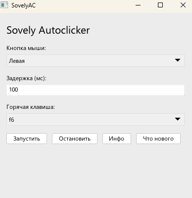

# SovelyAutoclicker – простой автокликер, написанный на VLang

***1.0.2*** Интерфейс  

## Об SAC

**SAC** (*SovelyAutoclicker*) — Автокликер, который полностью написан на языке V. Использует библиотеку UI (v-ui).

## Функции SAC

- Настраиваемый интервал кликов
- Выбор клавиши для запуска
- Настройка кнопки мыши
- Простой интерфейс
- Малый вес файла
- Малая нагрузка на систему

## Скачать SovelyAutoclicker

